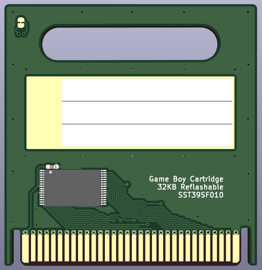
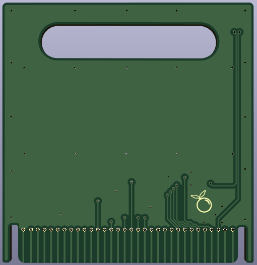

# PCB Cart 32

**YOU MAY NOT MANUFACTURE THESE TO RESELL!** Don't do it, please. This is a fun community thing - buy a bunch, spread the love! 🧡

---

A Game Boy flash cartridge designed to work without a plastic shell. 32KB, so perfect for small games like Tetris, or utilities like my [Better Button Test](https://github.com/orangeglo/better-button-test).

Two parts...
- [SST39SF010A](https://www.digikey.com/en/products/detail/microchip-technology/SST39SF010A-70-4C-WHE/2297827) flash chip
- 0603 0.1uF ceramic cap

Order as...
- 2mm PCB (Up to 2.4mm may work as well, untested)
- ENIG finish

I recommend ordering from [JLC](jlcpcb.com), as they offer the 2mm option for a reasonable price at largish quantities.

## [DOWNLOAD GERBERS](https://github.com/orangeglo/pcb-cart-32/releases/latest)

Front                      |  Back
:-----------------------------------------:|:-------------------------:
| 
